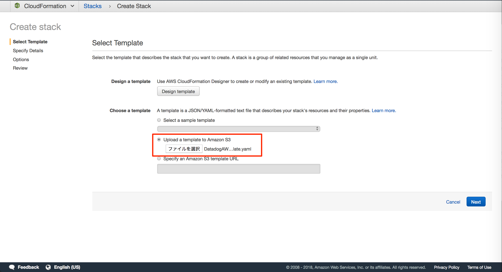
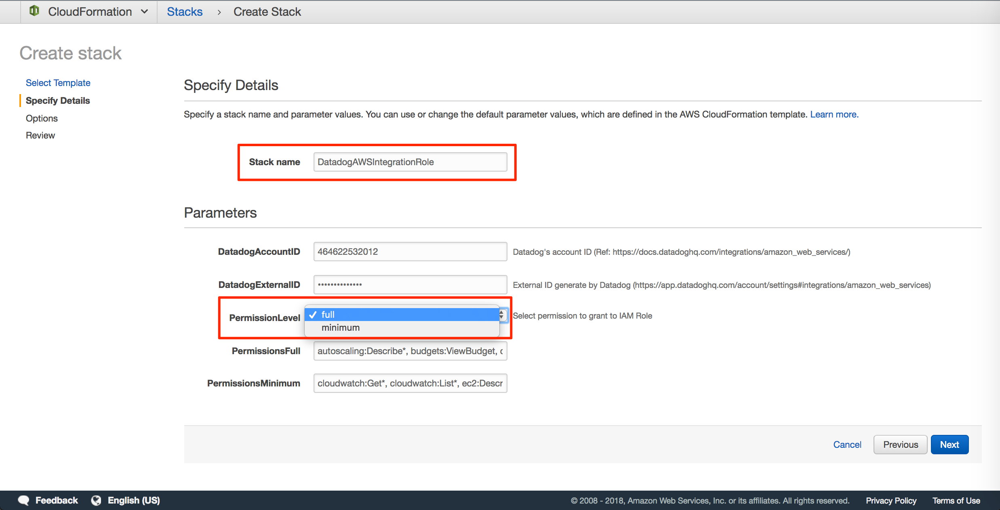
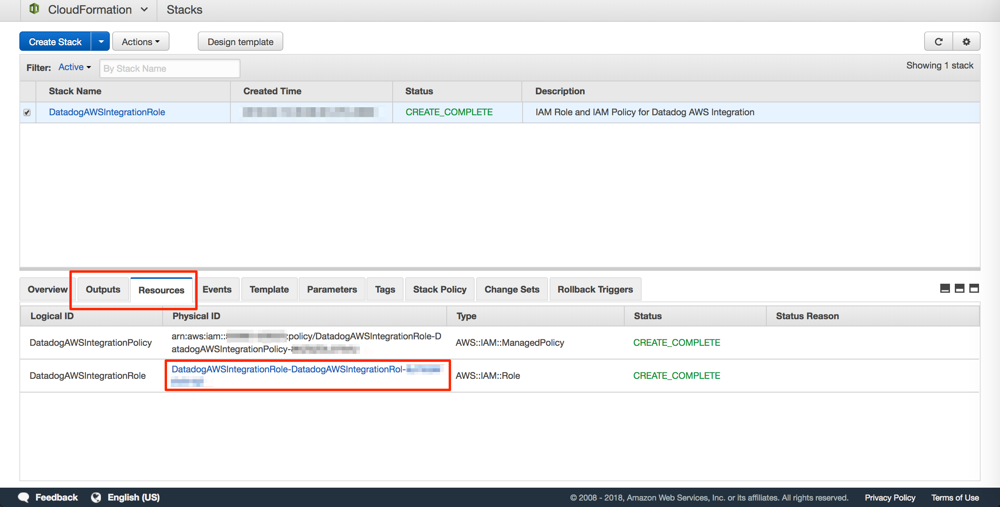
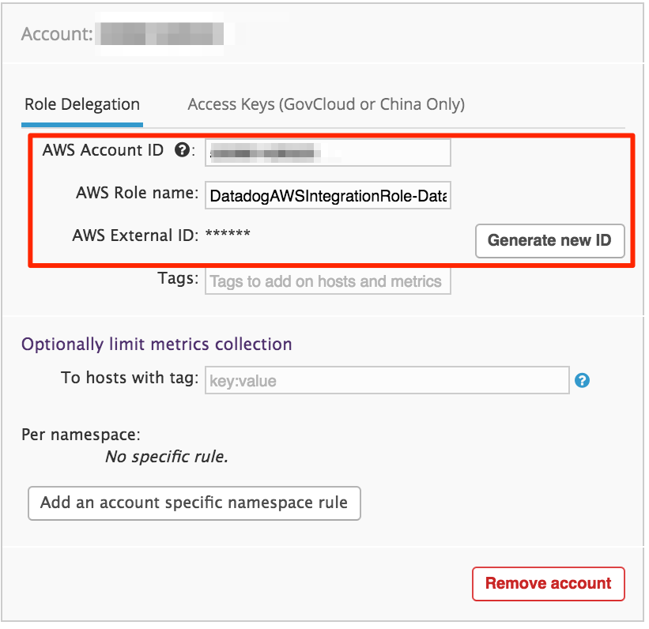
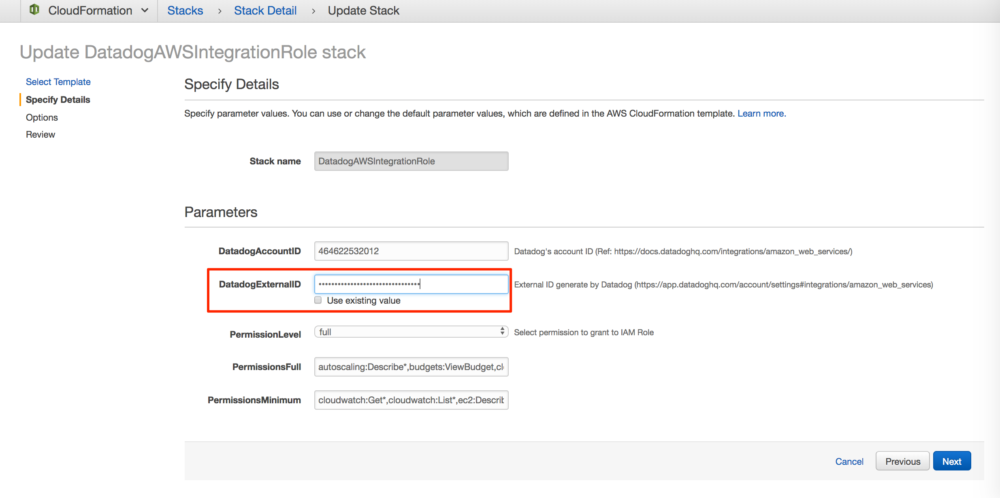

# dd-aws-integration-role-cfn
Datadog AWS Integration IAM Role and Policy cloudformation template

* **Currently, Datadog official CloudFormation template are available.**
  * **See [AWS integration - Datadog Docs](https://docs.datadoghq.com/integrations/amazon_web_services/)**

## Reference

- [Datadog AWS Integration](https://docs.datadoghq.com/integrations/amazon_web_services/#installation)

## Usage

Download [template file](IAM/DatadogAWSIntegrationRole.template.yaml)

### 1. Create Stack

- Upload template.yaml to CloudFormation



- Choose permissions to grant when uploading



- Get IAM RoleName



#### CLI

```bash
STACK_NAME="DatadogAWSIntegrationRoleStack"

# create-stack
aws cloudformation create-stack \
  --stack-name ${STACK_NAME} \
  --template-body file://IAM/DatadogAWSIntegrationRole.template.yaml \
  --capabilities CAPABILITY_IAM

# Wait for create-stack to complete
aws cloudformation wait stack-create-complete \
  --stack-name ${STACK_NAME}

# Get IAM Role Name
aws cloudformation describe-stack-resource \
  --stack-name ${STACK_NAME} \
  --logical-resource-id DatadogAWSIntegrationRole \
  --query 'StackResourceDetail.PhysicalResourceId'
```

### 2. Generate ExternalID on Datadog

Generate ExternalID on Datadog AWS Integration page.



### 3. Update Stack

- Update CloudFormation Stack
  - "DatadogExternalID" specifies the generated ExternalID



#### CLI

```bash
STACK_NAME="DatadogAWSIntegrationRoleStack"
EXTERNAL_ID=""

# update-stack
## "DatadogExternalID" specifies the generated ExternalID
aws cloudformation update-stack \
  --stack-name ${STACK_NAME} \
  --template-body file://IAM/DatadogAWSIntegrationRole.template.yaml \
  --capabilities CAPABILITY_IAM \
  --parameters "ParameterKey=DatadogExternalID,ParameterValue=${EXTERNAL_ID}"

# Wait for update-stack to complete
aws cloudformation wait stack-update-complete \
  --stack-name ${STACK_NAME}
```

## When you want to give a specific name

Uncomment RoleName/ManagedPolicyName and set arbitrary value.

- IAM/DatadogAWSIntegrationRole.template.yaml


```
--- a/IAM/DatadogAWSIntegrationRole.template.yaml
+++ b/IAM/DatadogAWSIntegrationRole.template.yaml
@@ -129,7 +129,7 @@ Resources:
       Roles:
       - Ref: DatadogAWSIntegrationRole
       # When you want to give a specific name
-      #ManagedPolicyName: "DatadogAWSIntegrationRolePolicy"
+      ManagedPolicyName: "DatadogAWSIntegrationRolePolicy"
     Type: AWS::IAM::ManagedPolicy
   DatadogAWSIntegrationRole:
     Properties:
@@ -147,5 +147,5 @@ Resources:
               Fn::Sub: arn:aws:iam::${DatadogAccountID}:root
         Version: '2012-10-17'
       # When you want to give a specific name
-      #RoleName: 'DatadogAWSIntegrationRole'
+      RoleName: 'DatadogAWSIntegrationRole'
     Type: AWS::IAM::Role
```

- When specified a name, you need to use CAPABILITY_NAMED_IAM instead of CAPABILITY_IAM at create/update stack.
